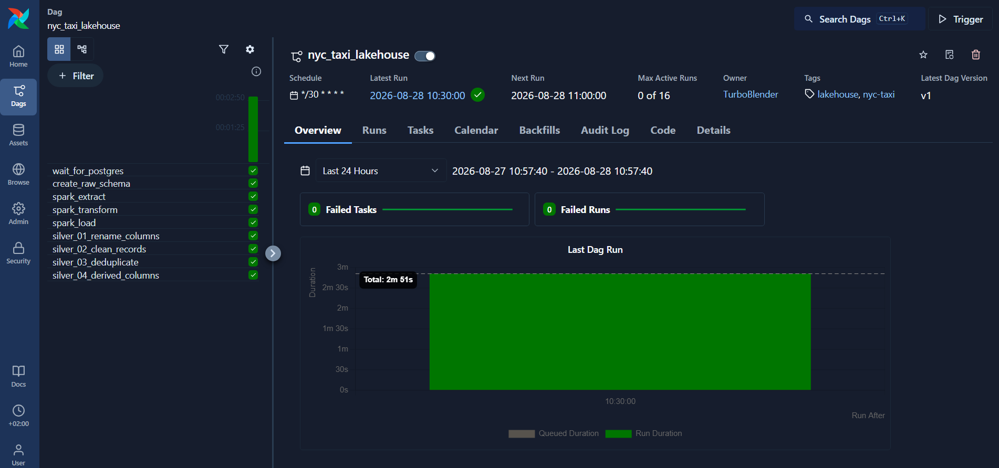
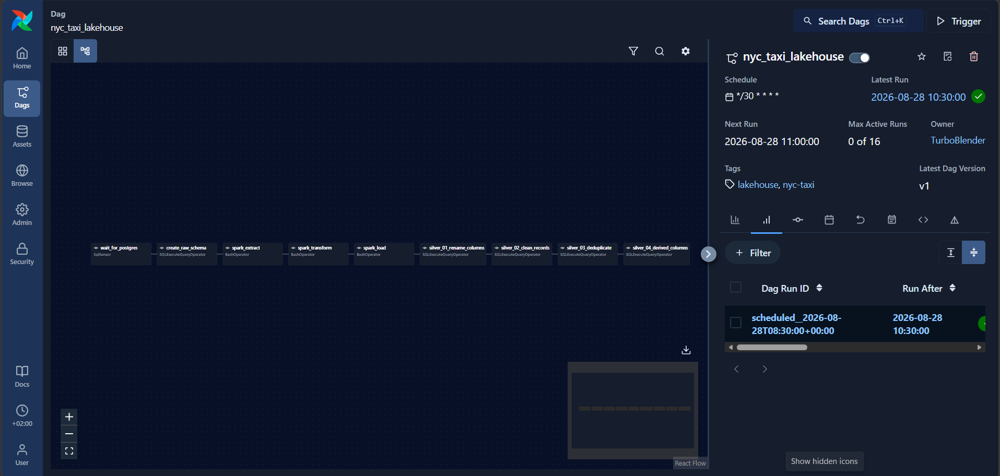
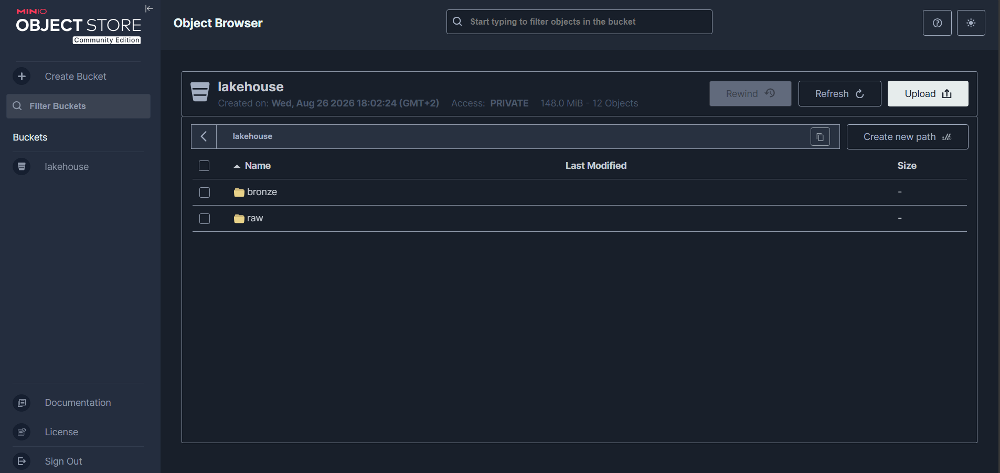
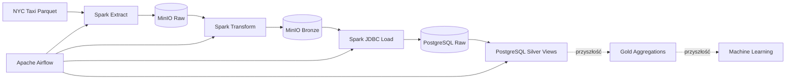
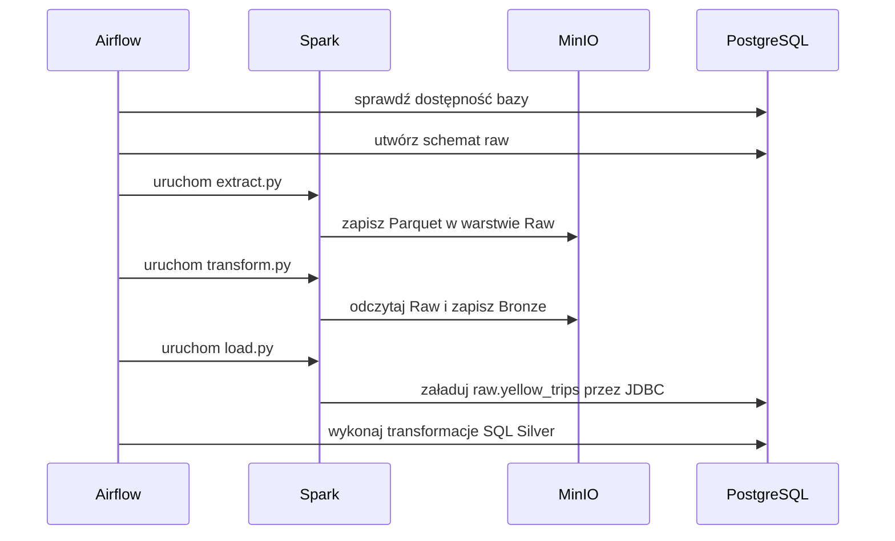
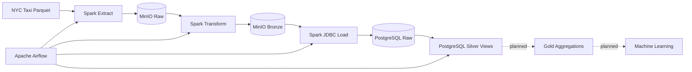

# NYC Taxi Lakehouse

**Lokalny pipeline danych dla przejazdów NYC Yellow Taxi**, zbudowany na Apache Spark, Airflow, MinIO i PostgreSQL.

`Apache Airflow · PySpark · MinIO · PostgreSQL · Docker · SQL · Jupyter`

Projekt pobiera dane przejazdów NYC Taxi, zapisuje je w lokalnym data lake opartym o MinIO, przetwarza w PySpark i udostępnia oczyszczoną warstwę Silver w PostgreSQL. Cały pipeline jest orkiestrwany przez Apache Airflow i uruchamiany lokalnie w Docker Compose.

> **Status projektu:** pipeline Raw → Bronze → Silver działa end-to-end. Testy automatyczne, warstwa Gold oraz część Machine Learning są zaplanowane do implementacji w kolejnych etapach.

[English version ↓](#english-version)

## Spis treści

- [Funkcje](#funkcje)
- [Zrzuty ekranu](#zrzuty-ekranu)
- [Status implementacji](#status-implementacji)
- [Architektura](#architektura)
- [Przepływ danych](#przepływ-danych)
- [Warstwy danych](#warstwy-danych)
- [Orkiestracja w Airflow](#orkiestracja-w-airflow)
- [Stack technologiczny](#stack-technologiczny)
- [Źródło danych](#źródło-danych)
- [Struktura projektu](#struktura-projektu)
- [Szybki start](#szybki-start)
- [Walidacja pipeline'u](#walidacja-pipelineu)
- [Roadmap](#roadmap)
- [Autor i kontakt](#autor-i-kontakt)

## Funkcje

- **Konteneryzowane środowisko** – cały stack uruchamiany przez Docker Compose
- **Orkiestracja ETL** – DAG Airflow wykonujący pipeline co 30 minut
- **Lokalny data lake** – dane Raw i Bronze przechowywane w MinIO przez protokół S3A
- **Przetwarzanie rozproszone** – odczyt, filtrowanie i flagi jakości danych w PySpark
- **Warehouse w PostgreSQL** – załadunek danych przez JDBC do schematu `raw`
- **Warstwa Silver** – widoki SQL realizujące zmianę nazw kolumn, czyszczenie, deduplikację i tworzenie cech analitycznych
- **Eksploracja danych** – notebook Jupyter do analizy datasetu
- **Trwałe wolumeny** – osobne wolumeny dla MinIO, warehouse PostgreSQL i metadanych Airflow

## Zrzuty ekranu

### Działający DAG w Apache Airflow

Pełne wykonanie pipeline'u Raw → Bronze → Silver zakończone sukcesem.



### Graf zależności zadań

Sekwencyjny przepływ od sprawdzenia PostgreSQL, przez zadania Spark, do transformacji SQL warstwy Silver.



### Warstwy danych w MinIO

Bucket `lakehouse` z katalogami `raw` i `bronze`.



## Status implementacji

| Obszar | Status | Zakres |
| --- | --- | --- |
| Infrastruktura Docker | ✅ Gotowe | Spark, MinIO, PostgreSQL, Airflow, Redis |
| Ingestion / Raw | ✅ Gotowe | Parquet → MinIO |
| Transformacje / Bronze | ✅ Gotowe | filtr dat, kolumny daty, flagi jakości |
| Load do PostgreSQL | ✅ Gotowe | zapis JDBC do `raw.yellow_trips` |
| Warstwa Silver | ✅ Gotowe | rename, clean, deduplicate, derived columns |
| Orkiestracja Airflow | ✅ Gotowe | działający DAG end-to-end |
| Eksploracja danych | ✅ Gotowe | notebook Jupyter |
| Testy automatyczne | 🗓️ Planowane | testy jednostkowe, integracyjne i jakości danych |
| Warstwa Gold | 🗓️ Planowane | tabele agregacyjne i metryki biznesowe |
| Machine Learning | 🗓️ Planowane | przygotowanie cech, trening i ewaluacja modelu |
| Rozszerzenie danych | 🗓️ Planowane | kolejne miesiące i lata danych NYC Taxi |

## Architektura



| Komponent | Rola |
| --- | --- |
| **Apache Airflow** | Harmonogram, zależności i monitoring zadań pipeline'u |
| **Apache Spark** | Ingestion, transformacje i zapis danych przez JDBC |
| **MinIO** | Lokalny storage zgodny z S3 dla warstw Raw i Bronze |
| **PostgreSQL** | Warehouse dla schematów Raw i Silver |
| **Redis** | Broker komunikatów dla CeleryExecutor |
| **Jupyter** | Eksploracyjna analiza danych |

## Przepływ danych



1. Spark odczytuje lokalny plik Parquet z danymi Yellow Taxi.
2. Dane źródłowe trafiają do `s3a://lakehouse/raw/yellow/2026-01`.
3. Transformacja ogranicza dane do stycznia 2026, dodaje składowe daty oraz flagi jakości.
4. Wynik jest zapisywany w `s3a://lakehouse/bronze/yellow/2026-01`.
5. Spark ładuje Bronze przez JDBC do `raw.yellow_trips` w PostgreSQL.
6. Kolejne zadania SQL budują zależne widoki warstwy Silver.

## Warstwy danych

### Raw

Niezmienione dane źródłowe zapisane w MinIO jako Parquet. Warstwa pozwala ponownie wykonać transformacje bez pobierania datasetu.

### Bronze

Dane po podstawowej transformacji w PySpark:

- rekordy ograniczone do stycznia 2026,
- `pickup_year`, `pickup_month`, `pickup_day`,
- flagi nulli, błędnych dystansów, wartości ujemnych i niepoprawnych dat.

### Silver

Widoki PostgreSQL tworzone sekwencyjnie:

1. `silver.yellow_trips_renamed` – ujednolicone nazwy kolumn,
2. `silver.yellow_trips_cleaned` – odrzucenie niepoprawnych rekordów,
3. `silver.yellow_trips_deduplicated` – deduplikacja z `ROW_NUMBER()`,
4. `silver.yellow_trips` – czas przejazdu, średnia prędkość, procent napiwku i cechy czasowe.

### Gold i Machine Learning

Te elementy **nie są jeszcze zaimplementowane**. Planowana warstwa Gold będzie przechowywać agregaty gotowe do raportowania i modelowania, np. popyt według strefy i godziny, przychód, średnią długość przejazdu oraz trendy dzienne. Na jej podstawie powstanie część ML, przewidziana m.in. do predykcji popytu lub wartości przejazdu.

## Orkiestracja w Airflow

DAG `nyc_taxi_lakehouse` działa zgodnie z harmonogramem `*/30 * * * *`:

```text
wait_for_postgres
└── create_raw_schema
    └── spark_extract
        └── spark_transform
            └── spark_load
                └── silver_01_rename_columns
                    └── silver_02_clean_records
                        └── silver_03_deduplicate
                            └── silver_04_derived_columns
```

Zadania Spark są uruchamiane przez Airflow w kontenerze `nyc-taxi-spark`. Zadania Silver wykonują pliki SQL bezpośrednio w PostgreSQL.

## Stack technologiczny

- **Apache Airflow 3.3.1** – orkiestracja z CeleryExecutor
- **Apache Spark / PySpark 3.5.6** – przetwarzanie danych
- **MinIO** – lokalny object storage zgodny z S3
- **PostgreSQL 16** – warehouse i baza metadanych Airflow
- **Redis 7.2** – broker Celery
- **Docker Compose** – lokalna orkiestracja usług
- **Python, SQL, pandas, PyArrow** – ETL i analiza
- **Jupyter Notebook** – eksploracja danych

## Źródło danych

Projekt wykorzystuje dane **NYC Yellow Taxi Trip Records** publikowane przez NYC Taxi & Limousine Commission:

- [TLC Trip Record Data](https://www.nyc.gov/site/tlc/about/tlc-trip-record-data.page)
- oczekiwany plik: `data/raw/yellow/yellow_tripdata_2026-01.parquet`
- dane obejmują m.in. czas odbioru i wysadzenia, strefy, dystans, sposób płatności, opłaty i napiwki

Pliki danych nie są przechowywane w repozytorium – katalog `data/raw/` jest ignorowany przez Git.

Obecna wersja pipeline'u przetwarza wyłącznie dane Yellow Taxi ze stycznia 2026. W kolejnych etapach ingestion zostanie rozszerzony o wiele miesięcy i lat, wraz z parametryzacją zakresu dat oraz obsługą przyrostowego ładowania danych.

## Struktura projektu

```text
nyc-taxi-lakehouse/
├── airflow/
│   ├── config/                 # Konfiguracja Airflow
│   ├── dags/
│   │   └── dag.py              # Definicja pipeline'u
│   ├── logs/                   # Logi runtime, ignorowane przez Git
│   └── plugins/
├── data/
│   └── raw/yellow/             # Lokalny plik źródłowy Parquet
├── docker/
│   ├── Dockerfile              # Obraz Spark + S3A + JDBC
│   └── Dockerfile.airflow      # Obraz Airflow + Docker CLI
├── images/                     # Zrzuty ekranu do README
├── notebooks/
│   └── data_exploration.ipynb
├── src/
│   ├── etl/
│   │   ├── extract.py
│   │   ├── transform.py
│   │   └── load.py
│   └── SQL/silver/
│       ├── 01_rename_columns.sql
│       ├── 02_clean_records.sql
│       ├── 03_deduplicate.sql
│       └── 04_derived_columns.sql
├── .env.example
├── docker-compose.yaml
└── requirements.txt
```

## Szybki start

### Wymagania

- Docker Desktop z Docker Compose
- co najmniej 4 GB pamięci dostępnej dla Dockera
- plik NYC Taxi Parquet dla stycznia 2026

### 1. Przygotuj dane

Umieść pobrany plik pod ścieżką:

```text
data/raw/yellow/yellow_tripdata_2026-01.parquet
```

### 2. Skonfiguruj środowisko

Linux/macOS:

```bash
cp .env.example .env
```

Windows PowerShell:

```powershell
Copy-Item .env.example .env
```

Uzupełnij `.env`, przykładowo:

```env
MINIO_ROOT_USER=minio1234
MINIO_ROOT_PASSWORD=minio12345
MINIO_ENDPOINT_S3=http://minio:9000

POSTGRES_USER=postgres
POSTGRES_PASSWORD=postgres
POSTGRES_DB=warehouse

AIRFLOW_UID=50000
AIRFLOW_PROJ_DIR=./airflow
_AIRFLOW_WWW_USER_USERNAME=admin
_AIRFLOW_WWW_USER_PASSWORD=admin
AIRFLOW__API_AUTH__JWT_SECRET=nyc_taxi_jwt_secret
FERNET_KEY=
```

Nie commituj pliku `.env` ani rzeczywistych haseł.

### 3. Uruchom stack

```bash
docker compose up -d --build --wait
```

Pierwszy build pobiera obrazy i biblioteki JAR dla S3A oraz PostgreSQL JDBC, dlatego może potrwać kilka minut.

### 4. Utwórz bucket MinIO

Otwórz MinIO Console pod adresem [http://localhost:9001](http://localhost:9001), zaloguj się danymi `MINIO_ROOT_USER` i `MINIO_ROOT_PASSWORD`, a następnie utwórz bucket o nazwie:

```text
lakehouse
```

Bucket nie jest obecnie tworzony automatycznie i musi istnieć przed pierwszym uruchomieniem zadania `spark_extract`.

### 5. Uruchom pipeline

Otwórz Airflow pod adresem [http://localhost:8080](http://localhost:8080), zaloguj się domyślnie jako `admin` / `admin`, włącz DAG `nyc_taxi_lakehouse` i uruchom go ręcznie. Kolejne wykonania będą uruchamiane co 30 minut.

### Dostępne usługi

| Usługa | Adres |
| --- | --- |
| Airflow | [http://localhost:8080](http://localhost:8080) |
| MinIO Console | [http://localhost:9001](http://localhost:9001) |
| MinIO S3 API | `http://localhost:9000` |
| PostgreSQL | `localhost:5432` |

## Walidacja pipeline'u

Projekt nie ma jeszcze testów automatycznych. Aktualnie pipeline można zweryfikować ręcznie:

1. Sprawdź w Airflow, czy wszystkie zadania DAG-a zakończyły się statusem `success`.
2. Potwierdź obecność danych Raw i Bronze w buckecie `lakehouse` przez MinIO Console.
3. Sprawdź liczbę rekordów w PostgreSQL:

```sql
SELECT COUNT(*) FROM raw.yellow_trips;
SELECT COUNT(*) FROM silver.yellow_trips;
```

4. Zweryfikuj przykładowe cechy warstwy Silver:

```sql
SELECT
    pickup_date,
    pickup_hour,
    trip_duration_minutes,
    avg_speed_mph,
    tip_percentage
FROM silver.yellow_trips
LIMIT 10;
```

## Roadmap

- [x] Konteneryzacja Spark, MinIO, PostgreSQL i Airflow
- [x] Pipeline Raw → Bronze → PostgreSQL Raw → Silver
- [x] Harmonogram i monitoring zadań w Airflow
- [x] Czyszczenie, deduplikacja i cechy analityczne
- [ ] Testy jednostkowe transformacji PySpark
- [ ] Testy integracyjne MinIO, PostgreSQL i DAG-a
- [ ] Automatyczne testy jakości danych
- [ ] Automatyczne tworzenie bucketa MinIO
- [ ] Parametryzacja pipeline'u dla różnych miesięcy i lat
- [ ] Ingestion historycznych danych NYC Taxi
- [ ] Przyrostowe ładowanie nowych okresów
- [ ] Warstwa Gold z agregatami biznesowymi
- [ ] Dashboard BI oparty o warstwę Gold
- [ ] Feature engineering i pipeline Machine Learning
- [ ] Trening, ewaluacja i wersjonowanie modelu
- [ ] CI/CD

## O projekcie

NYC Taxi Lakehouse powstał jako praktyczny projekt data engineeringowy. Celem jest zbudowanie kompletnego, lokalnego środowiska odwzorowującego kolejne etapy nowoczesnego pipeline'u danych: object storage, przetwarzanie rozproszone, orkiestrację, warehouse, warstwy analityczne, testy jakości oraz – w dalszym etapie – Machine Learning.

## Autor i kontakt

| | |
| --- | --- |
| **Autor** | Maciej Spychalski ([Turbo-Blender](https://github.com/Turbo-Blender)) |
| **Email** | [m.spychalskipv@gmail.com](mailto:m.spychalskipv@gmail.com) |
| **Repozytorium** | [github.com/Turbo-Blender/nyc-taxi-lakehouse](https://github.com/Turbo-Blender/nyc-taxi-lakehouse) |

---

<a id="english-version"></a>

# NYC Taxi Lakehouse

**A local NYC Yellow Taxi data pipeline** built with Apache Spark, Airflow, MinIO, and PostgreSQL.

`Apache Airflow · PySpark · MinIO · PostgreSQL · Docker · SQL · Jupyter`

The project ingests NYC Taxi Parquet data into an S3-compatible local data lake, transforms it with PySpark, loads it into PostgreSQL, and builds an analytics-ready Silver layer. Apache Airflow orchestrates the complete pipeline in Docker Compose.

[Polska wersja ↑](#nyc-taxi-lakehouse)

> **Project status:** the Raw → Bronze → Silver pipeline works end-to-end. Automated tests, a Gold layer, and Machine Learning are planned for future development.

## Implemented features

- Dockerized Spark, MinIO, PostgreSQL, Airflow, and Redis environment
- Airflow DAG scheduled every 30 minutes
- Raw and Bronze Parquet storage in MinIO through S3A
- PySpark date filtering, date components, and data-quality flags
- JDBC load into `raw.yellow_trips`
- Silver SQL views for renaming, cleaning, deduplication, and derived analytics columns
- Jupyter notebook for exploratory data analysis

## Screenshots

### Successful Airflow DAG run


### DAG dependency graph


### Raw and Bronze layers in MinIO


## Architecture



## Data layers

- **Raw** – unchanged source Parquet stored in MinIO
- **Bronze** – January 2026 records enriched with date components and quality flags
- **PostgreSQL Raw** – Bronze data loaded through Spark JDBC
- **Silver** – cleaned, deduplicated data with duration, speed, tip, and time features
- **Gold** – planned business aggregates for reporting and modeling
- **Machine Learning** – planned feature, training, and evaluation pipeline

The current pipeline processes Yellow Taxi data for January 2026 only. Future development will extend ingestion across multiple months and years, parameterize date ranges, and introduce incremental loading for new periods.

## Quick start

1. Place the source file at:

```text
data/raw/yellow/yellow_tripdata_2026-01.parquet
```

2. Create and fill `.env`:

```powershell
Copy-Item .env.example .env
```

```env
MINIO_ROOT_USER=minio1234
MINIO_ROOT_PASSWORD=minio12345
MINIO_ENDPOINT_S3=http://minio:9000

POSTGRES_USER=postgres
POSTGRES_PASSWORD=postgres
POSTGRES_DB=warehouse

AIRFLOW_UID=50000
AIRFLOW_PROJ_DIR=./airflow
_AIRFLOW_WWW_USER_USERNAME=admin
_AIRFLOW_WWW_USER_PASSWORD=admin
AIRFLOW__API_AUTH__JWT_SECRET=nyc_taxi_jwt_secret
FERNET_KEY=
```

3. Start the stack:

```bash
docker compose up -d --build --wait
```

4. Open [MinIO Console](http://localhost:9001), sign in with the configured MinIO credentials, and create the `lakehouse` bucket. The bucket is not currently bootstrapped automatically.

5. Open [Airflow](http://localhost:8080), enable `nyc_taxi_lakehouse`, and trigger the DAG. The local default login is `admin` / `admin`.

MinIO Console is available at [http://localhost:9001](http://localhost:9001), and PostgreSQL is exposed on `localhost:5432`.

## Current limitations and roadmap

The operational pipeline is complete through the Silver layer, but the project does **not yet include automated tests, Gold models, or ML code**.

- [ ] Unit tests for PySpark transformations
- [ ] Integration tests for MinIO, PostgreSQL, and Airflow
- [ ] Automated data-quality checks
- [ ] Automatic MinIO bucket bootstrap
- [ ] Parameterized ingestion across multiple months and years
- [ ] Historical NYC Taxi data backfill
- [ ] Incremental loading of new periods
- [ ] Gold business aggregates
- [ ] BI dashboard
- [ ] ML feature engineering, training, evaluation, and model versioning
- [ ] CI/CD

Until automated tests are added, validation is performed manually through Airflow task statuses, MinIO objects, and SQL checks in PostgreSQL.

## Data source

The project uses [NYC Taxi & Limousine Commission Trip Record Data](https://www.nyc.gov/site/tlc/about/tlc-trip-record-data.page). Source files are excluded from Git.

## Author & contact

| | |
| --- | --- |
| **Author** | Maciej Spychalski ([Turbo-Blender](https://github.com/Turbo-Blender)) |
| **Email** | [m.spychalskipv@gmail.com](mailto:m.spychalskipv@gmail.com) |
| **Repository** | [github.com/Turbo-Blender/nyc-taxi-lakehouse](https://github.com/Turbo-Blender/nyc-taxi-lakehouse) |